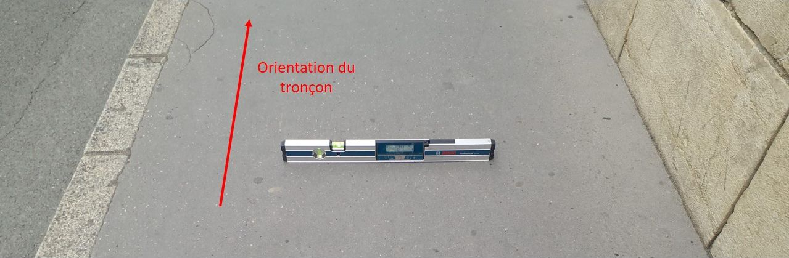
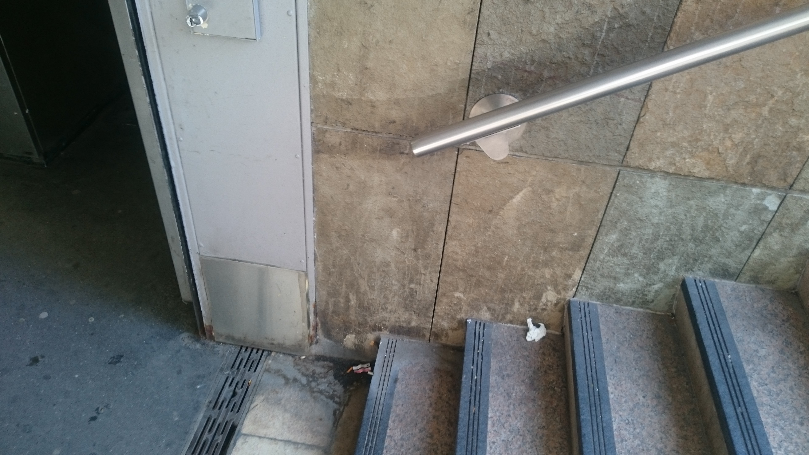

# Guide méthodologique de collecte du standard CNIG Accessibilité

## 1- Contexte et objectifs de ce guide&#x20;

### Contexte&#x20;

Ce guide vient compléter le [standard CNIG Accessiblité](http://cnig.gouv.fr/?page_id=25335).&#x20;

Le contexte général est décrit dans "Chantiers de collecte des données d’accessibilité : [Conseils et recommandations – Guide de la DMA](https://www.ecologie.gouv.fr/donnees-daccessibilite)"

### Objectifs du guide méthodologique

Le standard CNIG Accessibilité est visé par le [décret n° 2021-836 du 29 juin 2021 relatif à la collecte des données décrivant l'accessibilité des itinéraires pédestres mentionnés à l'article L. 141-13 du code de la voirie routière](https://www.legifrance.gouv.fr/jorf/id/JORFTEXT000043714243).

Le standard ayant une portée réglementaire, ce guide vient y apporter tout élément concret et utile avec plus de souplesse et d'interactivité.

L'approche se veut pragmatique, fournissant des ressources et des bonnes pratiques pour la collecte et la structuration des bases de données relatives à l'accessibilité des cheminements dans les domaines voirie, espace public et établissements recevant du public (ERP).

#### Public du guide

Les collectivités territoriales et leurs prestataires, pour l'élaboration des bases de données d'accessibilité, dans le périmètre et les échéances visés par la LOM.

#### Contributions et licence


​Ce guide est rédigé par le [groupe de travail CNIG Accessibilité](http://cnig.gouv.fr/?page_id=18058) et publié sous [licence ouverte v2.0 Etalab](https://www.etalab.gouv.fr/licence-ouverte-open-licence)


### Structure du guide et modèle conceptuel de données

Pour apporter de la clarté en évitant les redondances avec le standard, le guide se focalise sur la collecte de données.

Dans ce guide **ne sont détaillés que les objets et les attributs pour lesquels des précisions sont nécessaires** vis-à-vis de la collecte de données ou de la compréhension du standard.

Sa table des matières reprend la structure du **catalogue d'objets** (partie 3.3 du standard).&#x20;

Le catalogue d'objets du standard s'appuie sur le modèle conceptuel de données Accessibilité, représenté graphiquement dans la partie 3.2 du standard.

Pour l'expliquer de façon simplifiée, le modèle de données est structuré en 3 éléments, hiérarchisés entre eux :

* L'élément "de base" est l'**objet** : un objet équivaut à un élément de l'environnement que le collecteur de données souhaite relever pour l'intégrer dans la base de données. Tous les objets de même nature sont regroupés dans une même **classe d'objets**.&#x20;


Notez la particularité de la classe EQUIPEMENT\_ACCES qui est une hyperclasse : elle rassemble non pas tous les objets mais toutes les **classes d'objets** assimilables à des équipements d'accès (classe des traversées, classe des rampes, classe des escaliers, etc.)


* Chaque objet est défini par ses **attributs**, au premier rang duquel son identifiant, qui sera unique. Les attributs sont des précisions que le collecteur souhaite apporter à l'objet, qui vont lui permettre de le qualifier. Ils sont de différents types, selon l'information à codifier : chaîne de caractères pour une information écrite, décimal pour une mesure chiffrée, booléen pour une information binaire (oui/non), etc.  ;


**​Précisions concernant les attributs de type énuméré (type "liste")**

Ces attributs renvoient à une liste énumérée de valeurs possibles, codifiée dans la partie 3.5 du standard. Chaque valeur se voit donc attribuer un code à deux chiffres, qui est celui à renseigner dans l'attribut en question.&#x20;

Par convention :

* le code 00 exprime "inconnu", "non renseigné" ou "information non disponible" ;
* le code 99 exprime "sans objet".

Les autres codes dépendent du type énuméré auquel fait référence l'attribut. Ces codes sont définis en compatibilité avec le profil Accessibilité de NeTEx (Network Exchange) qui est le format européen d'échange de données, notamment sur les transports publics. Ceci explique le fait que les libellés soient parfois en anglais ou parfois redondants.

Un des objectifs de ce guide est donc de clarifier ces listes énumérées pour faciliter et harmoniser la collecte de données d'accessibilité à l'échelle française.


* Un objet est potentiellement lié à d'autres objets par des **relations**, qui permettent de définir l'agencement des objets les uns par rapport aux autres. Par exemple :  un obstacle est lié au tronçon de cheminement sur lequel il se situe. Une des relations les plus importantes est celle qui lie un tronçon de cheminement aux deux nœuds qui en constituent les extrémités, car cette relation permet de définir les connexions entre tronçons de cheminement, et de constituer ainsi des itinéraires de cheminement.

### Outils utiles pour la collecte des données

Pour collecter efficacement les données du standard sur le terrain, il est important de se munir :

* d'une **tablette ou d'un smartphone**, permettant la collecte géolocalisée des données et facilitant la prise de photos. Plusieurs logiciels de collecte existent et un outil de collecte spécifique au standard de données Accessibilité est en cours de développement par la DMA. Il est important de choisir un logiciel compatible avec les logiciels de SIG utilisés au bureau, mais également intuitif et fiable ;
* d'un **mètre-ruban** pour mesurer les distances, notamment les plus faibles (ressauts, largeurs d'obstacles...) ;
* d'un **inclinomètre** ou **niveau** à affichage numérique pour mesurer les pentes et dévers avec précision. Si possible, préférer un modèle faisant au moins 40 cm de long pour lisser les erreurs de mesure, et affichant les mesures en pourcentage (unité de référence du standard).

Pour faciliter la collecte ou pour la compléter, d'autres outils peut être utiles :

* un **télémètre laser** peut remplacer avantageusement l'inclinomètre (plus simple à transporter, quoique plus imprécis si le revêtement est irrégulier) et permet également de mesurer plus simplement des distances importantes (largeur d'un trottoir par exemple). Il ne peut cependant remplacer complètement le mètre-ruban (pour la mesure des ressauts, fentes...) ;
* un **odomètre** permet de mesurer les longueurs de cheminement, ce qui est particulièrement utile dans le cas de cheminements non-rectilignes.

## 2- La collecte et mise à jour de données Voirie

_Conseils méthodologiques pour le relevé Voirie_

### 2.1- Cheminement

Un cheminement est la description d'un itinéraire allant d'un point A à un point B. Ce n'est pas un objet disposant d'une géométrie en propre, mais une séquence de tronçons (qui sont définis dans le paragraphe 2.2 ci-dessous). Ainsi, la géométrie du cheminement est portée par la géométrie des tronçons qui le composent.

Attributs :

**idcheminement** : identifiant unique du cheminement

**libelle** : libellé (ou nom) du cheminement

### Comment définir les cheminements ?

L'**usage**, c'est-à-dire la réalité de la pratique d'un cheminement, constitue la "porte d'entrée" de la réflexion sur la collecte des données d'accessibilité et donc sur la définition de ces cheminements.

Ainsi, l'usage, les pratiques du lieu, doivent guider la réalisation du graphe de cheminement car l'une des finalités assumées de la collecte de données d'accessibilité est de **pouvoir proposer aux usagers des itinéraires adaptés selon leurs difficultés de mobilité**.

Il est conseillé de réaliser une première version du graphe de cheminement sur un territoire, en amont de la collecte. Voici une méthodologie simple pour ce faire :&#x20;

1. **définir les points d'intérêt du lieu :** ce seront les points de départ et/ou d'arrivée des cheminements. Ce sont, de façon non exhaustive, les arrêts de transport en commun, les accès piétons des parkings ou des ERP. Le niveau de finesse dans la liste de ces points d'intérêt est à décider en fonction de l'ambition de la collecte, mais aussi de l'ampleur des usages du lieu. Par exemple, pour une rue commerçante importante, on peut voir un intérêt à détailler l'entrée de chaque commerce.
2. **définir les cheminements entre les points d'intérêt**, selon le type de voirie empruntée :
   * le long d'une rue "simple" avec des circulations piétonnes des deux côtés, les cheminements sont prévus des deux côtés, en empruntant les trottoirs ; dans le cas général, on se place à peu près au milieu des trottoirs.
   * dans des espaces vastes, de type parvis ou place, les cheminements sont à déterminer suite à **une observation de terrain** **qui permet de repérer les cheminements naturels des piétons**, et en particulier les plus "accessibles". Ce sont les cheminements à collecter, pour peu qu'ils respectent le code de la route, et notamment qu'ils empruntent les passages piétons à proximité, s'ils existent. Une rationalisation de l'observation de terrain peut donc être nécessaire pour limiter le nombre de cheminements à intégrer au graphe final ;
   * si plusieurs chemins ("vraiment" différents) existent pour relier un point A à un point B, tous doivent être représentés sur le graphe de cheminement.
3. **détailler les cheminements**, en les découpant en tronçons reliés par des nœuds. Les tronçons et les nœuds de cheminement sont définis aux paragraphes 2.2 et 2.3 suivants. Attention : les tronçons de cheminement ne sont pas forcément rectilignes.\
   Ce découpage sera forcément sommaire dans un premier temps et affiné lors de la collecte ou en post-traitement : par exemple, si l'on se rend compte de l'hétérogénéité d'un tronçon au regard du cheminement collecté, il aura vocation à être coupé en deux tronçons. Mais un premier découpage est nécessaire en amont de la première visite de collecte, afin de simplifier celle-ci.

### 2.2- Tronçon de cheminement

Un tronçon est la plus petite fraction de cheminement ayant les mêmes caractéristiques physiques principales ("nature" du tronçon, pente, dévers...). Le tronçon se traduit, dans le standard, par une **ligne orientée** de son nœud initial à son nœud final. Cette connexion entre nœud et tronçon garantit la continuité du cheminement pour les calculs d'itinéraires.

Il n'est pas nécessaire de dédoubler les tronçons : un tronçon peut être parcouru dans les deux sens, aller ou retour.

Attention : un tronçon de cheminement n'est pas forcément rectiligne.


**Zoom sur l'orientation des tronçons**

L'orientation du tronçon est définie par : "nœud initial" vers "nœud final".

Par défaut, c'est la collecte initiale qui détermine le sens du tronçon.

Ce sens a une influence sur les valeurs des pentes et des dévers, qui sont des entiers positifs ou négatifs, selon l'inclinaison (par exemple : pente positive pour une montée et négative pour une descente). Ainsi, dans le cas d'une collecte en plusieurs temps ou d'une mise à jour de la collecte, il sera important de **se souvenir de l'orientation déjà définie des tronçons**.


Attributs : le tronçon supporte les caractéristiques physiques du cheminement suivantes :&#x20;

**idtroncon** : identifiant unique du tronçon (peut être renseigné en post traitement)

**from** : identifiant du nœud de cheminement de départ du tronçon (peut être renseigné en post traitement)

**to** : identifiant du nœud de cheminement d'arrivée du tronçon (peut être renseigné en post traitement)

**longueur :** distance réelle pour parcourir le tronçon de cheminement. La précision de saisie de la géométrie devant être de l'ordre du décimètre, cette longueur peut être déduite de la géométrie collectée, surtout si le tronçon est rectiligne. Un odomètre peut être utilisé également.

**typetronçon :** se reporter à la description des types énumérés du standard, cela décrit l'environnement que le tronçon de cheminement parcourt. Voici quelques précisions sur certains des types énumérés dans le standard :&#x20;

* 08 - navette : <mark style="color:red;">à définir</mark>
* 10 - présence de barrière(s) : permet de signaler si le chemin est bordé par des barrières de part et d'autre. Ne comprend pas les cas où le chemin est bordé de rangées de potelets.
* 11 - passage étroit : <mark style="color:red;">à définir pour ne pas être redondant avec le 14 et le 20</mark>
* 12 - hall : <mark style="color:red;">à définir</mark>
* 13 - couloir intérieur : comprend les rues couvertes, les passages publics mais intérieurs à un bâtiment, les traboules...
* 14 - espace confiné : <mark style="color:red;">à définir pour ne pas être redondant avec le 11 et le 20</mark>
* 16 - espace ouvert : comprend les places, esplanades et cours.
* 17 - rue : lui préférer le n°18 "trottoir" dans le cas d'une rue conventionnelle. A utiliser lorsque la circulation piétonne est indifférenciée de la circulation motorisée : impasse, voies de circulation des parkings...
* 18 - trottoir : comprend aussi les quais de transport en commun jouxtant les trottoirs.
* 19 - chemin piéton : ne comprend que les cheminements physiquement séparés de la voie de circulation des véhicules motorisés : rue piétonne, venelles piétonnes, sentes, voie verte par exemple. Ils peuvent être partagés avec les modes actifs (vélos, trottinettes).
* 20 - passage : comprend les ruelles étroites non empruntées par des véhicules motorisés.

**statutVoie** : permet de qualifier la voie bordant le tronçon de cheminement parcouru en se reportant à la description des types énumérés du standard.

**pente :** inclinaison la plus défavorable constatée sur le terrain, en pourcentage, dans le sens de saisie du tronçon (nœud initial vers nœud final).


L'attribut "pente", comme tous ceux qui dépendent du sens de circulation, est renseigné en considérant le parcours du nœud initial vers le nœud final  du tronçon correspondant.


Il s'agit d'une **valeur entière, signée**. La valeur est positive pour la montée et négative pour la descente. Exemples : 2, 5, -3 pour respectivement 1,9%, 5,2%, -3,4%.&#x20;

L'utilisation d'un inclinomètre d'au moins 40 cm est recommandée car cela permet de lisser les imperfections du revêtement. Certains laser-mètres permettent aussi de mesurer les pentes mais leur petite taille est plus sensible aux aspérités de surface, il faut donc choisir la partie la plus représentative de la pente.

.png>)

**devers :** inclinaison perpendiculaire au tronçon de cheminement. Elle est exprimée en **valeur entière absolue** du pourcentage, donc toujours positive (exemple : 2 pour 2,1%). En effet, contrairement à la pente, le dévers génère le même niveau d'inconfort quel que soit le coté de l'inclinaison, il n'est donc pas nécessaire d'orienter le dévers.

_**accessibiliteGlobale :** attribut facultatif, permet de faire une synthèse du niveau de l'accessibilité perçu par la personne collectrice, toutes familles de handicap confondues. En aval de la collecte, cet attribut est utilisé par le format d'échange NeTEx pour fournir une évaluation globale de l'accessibilité, à "dire d'expert" du tronçon de cheminement._

### 2.3- Nœud de cheminement

Le nœud de cheminement est le point qui assure le lien entre les tronçons de cheminement. Un nouveau nœud est donc créé :&#x20;

* à chaque bifurcation de cheminement ;
* lors de l'accès à un équipement ;
* à chaque changement important de caractéristique d'un cheminement (qui sera alors découpé en plusieurs tronçons). Les caractéristiques sont : **typetronçon, statutVoie, pente** et **devers** ;
* également pour marquer la présence d'une bande d'éveil à la vigilance, si l'on ne se trouve pas déjà dans l'un des trois cas précédents.

Le nœud est relevé de préférence en 3D.&#x20;

Attributs :&#x20;

**idnoeud** : identifiant unique du nœud (peut être renseigné en post traitement)

**altitude :** altitude du nœud de cheminement (renseignée automatiquement dans la géolocalisation)

Les attributs suivants ne sont à renseigner que lorsque le nœud relevé permet d'accéder à une traversée piétonne.

**bandeEveilVigilance :** permet de renseigner la présence et l'état de la Bande d'Eveil de Vigilance (BEV)

**hauteurRessaut :** hauteur entre le haut de la bordure et la chaussée.


Les ressauts de 2 cm avec un profil arrondi ou de 4 cm avec un profil chanfreiné ne  sont pas pris en compte.


**abaissePente :** pente due à l’inclinaison du trottoir vers la chaussée.

**abaisseLargeur :** distance sur laquelle la hauteur de bordure de trottoir est réduite à son maximum, hors rampants.


Dans la situation où c'est la chaussée qui "monte à hauteur du trottoir" la longueur d'affleurement peut être supérieure à 1,80 m. On considèrera dans ce cas que _la distance sur laquelle la hauteur de bordure de trottoir est réduite à son maximum_ est supérieure à 1,80 m, et on donnera par convention (cf standard §4.3 "Codifications des attributs de type "dimension") à abaisseLargeur la valeur 9999.


**masqueCovisibilité :** masque visuel sur 5 m en amont d'une traversée

**controleBEV :** types d'implantation de la BEV sur le trottoir. Les valeurs des types énumérés du standard (contrôle BEV) sont illustrées ci-dessous.

.jpg>)

.jpg>)

.jpg>)

.jpg>)

_**bandeInterception :** signale la présence ou l'absence d'une bande d'interception menant au nœud._

### 2.4- Obstacles

Les obstacles à relever dans le cadre du standard sont les éléments situés sur le cheminement pouvant gêner voire empêcher la circulation.

Le point de géolocalisation de l'obstacle est relevé est son centre ou centroïde.


On se contente de collecter les obstacles potentiellement gênants sur le parcours de cheminement


Attributs :&#x20;

**idobstacle** : identifiant unique de l'obstacle (peut être renseigné en post traitement)

**typeObstacle** : rappel : valeur 00 (non renseignée, inconnu) non autorisée. Précisions concernant certains types énumérés :&#x20;

* 03 - avaloir : comprend les grilles recouvrant les avaloirs d'eau pluviale
* 07 - mobilier urbain : comprend tous les mobiliers urbains non mentionnés dans les autres valeurs (notamment bancs, poubelles, mobilier temporaire...)
* 08 - végétation : à prendre au sens large : arbres, arbustes, herbes...
* 10 - surface irrégulière : comprend les zones ponctuelles où le revêtement est inexistant ou dégradé

**largeurUtile** : distance entre le bord du cheminement et l'obstacle, au droit du rétrécissement le plus pénalisant. Comme toute largeur utile dans le standard, celle-ci n'est pas mesurée au delà de 1m80 et prend alors la valeur conventionnelle "9999".


Rappel réglementaire : La largeur minimale du cheminement doit être de 1,40 mètre, libre de mobilier ou de tout autre obstacle éventuel. Cette largeur peut toutefois être réduite à 1,20 mètre en l'absence de mur ou d'obstacle de part et d'autre du cheminement. "


**positionObstacle** : position dans l'espace de l'obstacle

* 01 - en surface : comprend les obstacles surfaciques, de type trou, fente, flaque d'eau...
* 02 - posé au sol : comprend les obstacles ancrés dans le sol, de type poteau, potelet, mobilier urbain pérenne...
* 03 - en saillie : comprend les obstacles en hauteur, de type panneaux, dessous d'escaliers...

**longueurObstacle** : portion du tronçon de cheminement impactée par l'obstacle. C'est la dimension de l'obstacle qui est parallèle au cheminement.

.png>)

**rappelObstacle :** présence ou absence d'un rappel, détectable tactilement, à l'aplomb de l'obstacle, lorsque celui-ci est en saillie.\
Utiliser la valeur 99 - sans objet dans le cas d'un obstacle posé au sol ou en surface. &#x20;

**reperabiliteVisuelle :** contrôle visuel pour vérifier si un contraste visuel est présent ou absent sur l'obstacle. Le contraste visuel peut être entre l'obstacle et son environnement immédiat, mais aussi entre la partie haute (ou à hauteur d'yeux) et le reste de l'obstacle.

.png>)

_**largeurObstacle** : attribut facultatif, dimension de l'obstacle perpendiculairement au cheminement._

_Mesurer l'emprise de l'obstacle permet de se projeter sur son éventuel déplacement pour libérer de l'espace si nécessaire. Cela permet surtout de pouvoir vérifier le respect de l'abaque de détection en complétant avec la prise de mesure suivante (cf. **hauteurObsPoseSol**)_

_**hauteurObsPoseSol :** attribut facultatif, dimension verticale de l'obstacle._&#x20;

_Mesurer la hauteur de l'obstacle, quand celui-ci est posé sur le sol, permet surtout de pouvoir vérifier le respect de l'abaque de détection en complétant avec la prise de mesure précédente (cf. **largeurObstacle**)_

_**hauteurSousObs :** attribut facultatif, distance verticale entre le sol et le bas de l'obstacle en saillie._&#x20;

_Mesurer la hauteur sous l'obstacle, si celui-ci est en hauteur, permet de déterminer s'il présente un risque de heurt._&#x20;


**Rappel réglementaire :** S'ils ne peuvent être évités sur le cheminement, les obstacles en porte-à-faux laissent un passage libre d'au moins 2,20 mètres de hauteur.


### 2.5- Circulation

Un tronçon de cheminement est soit une CIRCULATION dite "normale" soit un EQUIPEMENT D'ACCES : par exemple un ESCALIER, une TRAVERSEE, etc. cf.[#2.6-equipement-dacces](./#2.6-equipement-dacces "mention")&#x20;

**Dans le cas général, le tronçon de cheminement est donc une CIRCULATION**.

Une circulation ne possède pas de géométrie car celle-ci est définie par le tronçon, mais elle décrit les caractéristiques de l’environnement de déplacement et porte des attributs caractérisant la capacité à circuler sur le tronçon : le type de sol (béton, asphalte, etc.), l'état du revêtement, la largeur de passage utile, etc.

Attributs :&#x20;

**idcirculation** : identification unique de la circulation

**typesol** : caractérisation du revêtement de sol. Précisions sur les types énumérés :&#x20;

* 17 - uneven : concerne tous les revêtements inégaux qui ne seraient pas caractérisés par un autre type (16 - graviers, 18 - stabilisé...).

**largeurUtile** : largeur de passage utile du cheminement libre de tout obstacle sur une hauteur de 2,20m. Elle est exprimée en mètre, avec une précision centimétrique (par exemple : 1.62  pour 1,62m).

Elle prend en compte la largeur de la bordure de trottoir, à condition bien sûr que celle-ci ne comporte pas d'obstacles au cheminement, potelets ou autres...


Il n'est pas nécessaire de mesurer la largeur de passage utile à partir du moment où elle est supérieure à 1,80m. Dans ce cas, on saisit la valeur conventionnelle 9999 qui signifie : _largeur supérieure à 1,80 ou "infinie"_.


**etatRevetement :** définition de l’état du revêtement. Permet de savoir s’il est présent (ou non), s’il est fonctionnel ou s'il présente des difficultés d’usages voire des dangers.

**eclairage** : qualification "à dire d'expert" du niveau d'éclairage du cheminement et de son adéquation pour les personnes déficientes visuelles.

**transition :** indication de si le tronçon est une montée, une descente ou bien s’il n’y a pas de changement de niveau. La valeur : "variable" est réservée aux escalators.


L'attribut "transition", comme tous ceux qui dépendent du sens de circulation (pente, etc.), est renseigné en considérant le parcours du nœud initial vers le nœud final du tronçon correspondant.


**typepassage :** caractérise l'environnement immédiat du cheminement. Précisions sur les types énumérés :&#x20;

* 01 - en surface : le cas le plus courant
* 03 - aérien : comprend les passerelles, les ponts
* 05 - tunnel : se différencie du "04 - passage souterrain" par le fait que le cheminement reste au niveau de la surface.

**repereLineaire** : caractérise l'absence ou le type de repère linéraire permettant à une personne aveugle ou malvoyante de détecter son chemin. Précisions sur les types énumérés :&#x20;

* 02 - façade ou mur
* 03 - bordure ou muret : présence d'une bordure en relief, continue, ou d'un muret
* 04 - revêtement différencié : comprend les changements de revêtement, y compris en bordure avec une zone enherbée, à partir du moment où elles sont de niveau
* 05 - bande de guidage : comprend uniquement les bandes respectant la norme NF 098-352


La distinction mur (02) ou muret (03) se fait suivant le critère de "hauteur d'homme" pour la visibilité et la perception auditive directe, sans obstacle.


_**couvert :** attribut facultatif. Cet attribut fait référence à la couverture du cheminement, permettant une indication supplémentaire sur une éventuelle protection contre la pluie ou le soleil. La photo ci-dessus illustre bien le principe d'un cheminement couvert._

### 2.6- Équipement d'accès

Comme signalé dans l'introduction de ce guide, la classe des équipements d'accès est en fait une hyperclasse. Elle ne contient donc pas d'attributs à proprement parler.

### 2.7- Traversée

Un tronçon de cheminement est catégorisé comme une traversée à partir du moment où le cheminement piéton rencontre (et traverse) la trajectoire d'autres utilisateurs (véhicules, transports en commun, vélos...). La traversée peut être matérialisée par un passage piéton (traversée de chaussée "standard") ou par un marquage ou revêtement différent (on parle dans ce cas de traversée "suggérée").

Attributs :

**idtraversee** : identification unique de la traversée

**etatRevetement :** La mesure concerne la praticabilité du revêtement. Cet état est fonction de son usure et concerne notamment la présence de dégradations entraînant un risque d'accroche du pied ou de secousses dans le cas de déplacement en fauteuil roulant.&#x20;

La prise de mesure consiste en un contrôle visuel et une estimation "à dire d'expert".

**bandesBlanches :** indication de la présence ou l'absence de "zebra" ou de bandes blanches clairement visibles pour les personnes malvoyantes. Indique si la traversée est une traversée "officielle" au sens de l'IISR (instruction interministérielle pour la signalisation routière, partie 7). Ce marquage au sol des traversées participe à l'identification visuelle de la zone de traversée. Il est notamment essentiel pour les chiens guides qui sont dressés à "chercher les lignes".

**marquageSol :** indication de la présence et, le cas échéant, de l'état du marquage au sol de la traversée (qui n'est pas forcément constitué de bandes blanches).&#x20;

La prise de mesure consiste en un contrôle visuel.

**eclairage :** qualification "à dire d'expert" du niveau d'éclairage du cheminement et de son adéquation pour les personnes déficientes visuelles.

**feuPietons :** indication de l'équipement de la traversée piétonne par une signalisation lumineuse de type R12, R24 ou R25 (IISR, partie 6).

<figure><figcaption></figcaption></figure>

**aideSonore :** On indique si la traversée piétonne est équipée d'une balise sonore permettant de délivrer un message indiquant la couleur du feu piéton.

La prise de mesure se fait en déclenchant la balise par pression sur la "télécommande accessibilité". L'auditeur indique si le message vocal est activé et s'il est audible.

**repereLineaire :** Le repère linéaire au sol permet notamment de repérer les limites latérales du passage dédié à la traversée piétonne. Il est donc généralement implanté de manière continue sur l'un ou les deux bords du passage. A défaut, un repère unique positionné de préférence au centre du passage permet aux usagers de le suivre, mais cela demande une concentration plus importante.

Ce repère est contrasté visuellement et podotactile.

La prise de mesure consiste en un contrôle visuel.

Valeurs autorisée : voir paragraphe "[Circulation](./#2.5-circulation)"

**presenceIlot :** Cet attribut indique la présence (oui / non) d'un îlot central aménagé sur la traversée. Les traversées de voies devant être le plus simples possible, dans certains cas (largeur de voie, vitesse de circulation), un îlot central est aménagé. Ce dispositif peut complexifier la traversée de certains usagers, il est donc important d'en faire état.&#x20;


La présence des bandes d'éveil à la vigilance (BEV) étant renseignée sur les nœuds de cheminements, un îlot central dépourvu de BEV nécessite de décomposer la traversée en trois tronçons afin de renseigner les nœuds intermédiaires sur la présence ou absence de BEV.


La prise de mesure consiste en un contrôle visuel.

**chausseeBombee :** Pour assurer la continuité de la chaîne de déplacement, il est essentiel de faire état de la pente du cheminement sur la chaussée. Bien souvent, cette portion peut-être bombée à des degrés divers générant des difficultés de circulation et parfois des difficultés à regagner le trottoir.

_**covisibilite :** attribut facultatif. Pour optimiser la sécurité aux abords de la traversée, tous les acteurs doivent se voir mutuellement pour anticiper la bonne attitude à adopter._&#x20;

_La prise de mesure consiste en un contrôle visuel pour indiquer la présence éventuelle d'un masque visuel positionné à 5 mètres en amont de la traversée (végétation, stationnement, mobilier…)._

### 2.8- Rampe d'accès

**etatRevetement :** Cf. 2.5 Circulation - etatRevetement

**largeurUtile :** La largeur utile concerne la largeur circulable (hors obstacles éventuels).&#x20;

La prise de mesure se fait à l'aide d'un mètre ruban ou d'un télémètre à l'endroit où le passage est le plus étroit. Selon les cas, la mesure se prend au sol ou à hauteur de tête en position assise.

**mainCourante :** Une main courante permet à l'utilisateur de prendre appui pour se soutenir et corriger une position inconfortable en montée ou en descente.

Un contrôle visuel permettra de renseigner de quel(s) côté(s) se situe la (les) main(s) courante(s)

**distPalierRepos :** Un palier de repos de 1,20m de longueur doit être positionné en bas et en haut de chaque rampe. Il permet à l'utilisateur de bien se positionner avant d'emprunter la rampe ou de préparer une éventuelle manœuvre de porte. Dans le cas d'une longue rampe, un palier de repos intermédiaire doit être implanté tous les 10 mètres.

La prise de mesure se fait par contrôle visuel pour valider la présence du palier de repos puis à l'aide d'un mètre ruban ou d'un télémètre pour vérifier l'inter distance (bord à bord) des paliers de repos.

**chasseRoue :** En cas de difficulté à conserver une direction droite dans son déplacement, l'usager peut avoir besoin d'un élément rassurant et sécurisant qui peut se matérialiser par une bordure latérale en bordure de rampe. Cet aménagement appelé bordure chasse-roue vise à bloquer la roue du fauteuil roulant avant qu'il ne tombe. On indiquera le(s) coté(s) concernés à l'instar de la main courante.

**aireRotation** se mesure au sol et doit également être libre de tout obstacle en hauteur.

_**poidsSupporte :** attribut facultatif. Certains matériels roulants (notamment électriques) peuvent peser très lourd. Il est donc important de pouvoir connaître le poids supporté par les rampes installées._

_La prise de mesure consiste en un contrôle visuel :  le poids maximum supporté est généralement indiqué sur une plaque apparente sur l'équipement._

### 2.9- Escalier

**etatRevetement :** Cf. 5. Circulation - etatRevetement

**mainCourante :** Indiquer la présence

**dispositifVigilance :** Les personnes mal et non-voyantes ont besoin d'être alertées sur la présence d'un risque de chute. Ainsi, en haut de tout escalier il est nécessaire d'installer une Bande d'Eveil à la Vigilance (BEV). Celle-ci doit être choisie et installée conformément à la norme NF EN 98-351.&#x20;

La prise de mesure est visuelle pour valider la présence de la BEV et son niveau de contraste. Elle se fait ensuite  à l'aide d'un mètre ruban ou d'un télémètre pour vérifier qu'elle est positionnée à 50 cm du nez de la première marche.

**contrasteVisuel :** Les personnes mal-voyantes ont besoin d'être  de pouvoir repérer le bord des marches de l'escalier qu'ils empruntent. Ainsi, sur le nez de marche de la première et de la dernière marche composant chaque volée d’escalier, une bande visuellement contrastée de 5 cm de profondeur doit être présente sur l’intégralité de sa largeur.

La prise de mesure est visuelle pour valider la présence du contraste visuel. Elle se fait ensuite  à l'aide d'un mètre ruban ou d'un télémètre pour vérifier qu'elle mesure bien 5 cm.

**largeurUtile :** Pour garantir des conditions d'usage confortable et sécurisées, les escaliers devront respecter des dimensions minimales. La largeur minimale d'un escalier est de 1,20 mètre s'il ne comporte aucun mur de chaque côté, de 1,30 mètre s'il comporte un mur d'un seul côté et de 1,40 mètre s'il est placé entre deux murs.


Un escalier "large" est-il supporté par un ou deux tronçons portant cet équipement linéaire ?

\=> On créé :&#x20;

* soit un tronçon et _mainCourantContinue_ (attribut optionnel de l'escalier) prend la valeur "au milieu"
* soit deux tronçons si l'on souhaite considérer deux escaliers de part et d'autre d'une main courante centrale.


La prise de mesure se fait par  à l'aide d'un mètre ruban ou d'un télémètre pour vérifier La largeur utile du passage.

_**mainCouranteContinue :** attribut facultatif. Les usagers doivent pouvoir utiliser la main courante en tout point de l'escalier. A ce titre elle est continue (sans rupture)_

_La prise de mesure se fait par  contrôle visuel._

_**prolongMainCourante :** attribut facultatif. Les usagers doivent pouvoir accéder en amont et la relâcher après avoir quitter la section d'escalier. A ce titre elle doit être prolongée de l'équivalent d'un giron (28 cm). Ce prolongement peut être dans la continuité, vers le bas ou vers le côté._

_La prise de mesure se fait par contrôle visuel pour vérifier la présence du prolongement et à l'aide d'un mètre ruban pour vérifier la longueur du prolongement._

_**nbMarches :** attribut facultatif. Pour cette donnée, il suffit de compter le nombre de marches._

_**nbVoleeMarches :** attribut facultatif. Pour cette donnée, il suffit de compter le nombre de sections de marches._

_**hauteurMarche :** attribut facultatif. Pour être franchissable sans plus de difficulté que nécessaire les marches devront  respecter une hauteur maximale de 16 cm et être homogènes._

_La prise de mesure se fait à l'aide d'un mètre ruban ou d'un télémètre laser au droit de la contremarche._

_**giron :** attribut facultatif. Afin de garantir un usage confortable le giron (profondeur de la marche) devra mesurer 28 cm minimum._&#x20;

La prise de mesure se fait à l'aide d'un mètre ruban ou d'un télémètre laser entre le nez de marche et la contremarche.

### 2.10- Escalator

**Sens :** L’attribut sens permet de définir le sens dans lequel l’escalator est emprunté. (Ainsi l’escalator peut être utilisée en montée, en descente ou encore être variable).

**dispositifVigilance :** Pour cet attribut il faut renseigner la présence d’un dispositif d’éveil à la vigilance et dans le cas de sa présence préciser son état.

**largeurUtile :** On renseigne ici la largeur utile pour rentrer dans l’ascenseur.

_**detecteur :** attribut facultatif. Pour cet attribut il faut indiquer si l’escalator se met en marche grâce à un détecteur._

_**supervision :** attribut facultatif. On indique si l’escalator est équipé d’un système de contrôle du fonctionnement à distance._

### 2.11- Tapis roulant

**sens :** sert à spécifier le sens de déplacement permis par le tapis roulant.&#x20;

Attention, la valeur "00", qui équivaut à "inconnu, non renseigné, information non disponible", n'est pas acceptable pour cet attribut. La valeur "03", équivalent à "variable", permet de spécifier si un tapis roulant a la particularité de changer de sens selon les besoins.

**dispositifVigilance :** sert à caractériser l'état du dispositif situé à l'arrivée sur le tapis roulant et qui sert à éveiller la vigilance vis-à-vis de ce tapis. Ce dispositif peut être une bande d'éveil à la vigilance, mais pas seulement.&#x20;

L'état de ce dispositif peut être son absence (valeur "01"), un bon état (valeur "02") ou des niveaux de dégradation plus ou moins importants (valeurs "03" à "05"). Sa conformité à la réglementation n'est pas étudiée, mais son usage doit être pris en compte. Il peut être établi par convention que, si un dispositif ne remplit donc pas son rôle d'alerte (qu'il soit réglementairement conforme ou non), les valeurs "04" ou "05" peuvent être utilisées. Attention, la valeur "00", qui équivaut à "inconnu, non renseigné, information non disponible", n'est pas acceptable pour cet attribut.&#x20;

Pour juger de cet état, le regard d'une personne sensibilisée au sujet de l'accessibilité est préférable.

**largeurUtile :** sert à mesurer la largeur du tapis roulant _libre de tout obstacle_, c'est-à-dire la largeur la plus étroite.&#x20;

La prise de mesure se fait à l'aide d'un mètre ruban ou d'un télémètre, entre les deux limites les plus rapprochées du tapis (attention à bien prendre en compte les surlargeurs représentées par les brosses au ras du tapis, comme le montre la photo ci-dessous).&#x20;

_**detecteur :** attribut facultatif. Sert à renseigner si un tapis roulant se déclenche automatiquement à la détection d'usagers s'engageant sur le tapis. Cet attribut est particulièrement utile pour permettre aux calculateurs d'itinéraires de prévenir les usagers de ce comportement qui peut surprendre. Notamment les personnes aveugles et malvoyantes, ainsi que les personnes ayant un trouble mental ou cognitif, mais aussi les personnes âgées ou les enfants, pourront être particulièrement déstabilisées par un sol qui se met à bouger sous leurs pieds, sans préavis._

_La prise de mesure se fait soit par connaissance du terrain, soit par test directement sur place._

### 2.12- Ascenseur

**largeurUtile :** On renseigne ici la largeur utile pour rentrer dans l’ascenseur.

**diamManoeuvreFauteuil :** Nous indiquons ici le diamètre de manœuvre disponible devant l’ascenseur, permettant le retournement d'une personne en fauteuil roulant ou avec une poussette par exemple.

**largeurCabine :** La largeur de la cabine correspond à la plus petite dimension de la cabine et est exprimée en mètre.

**longueurCabine :** La longueur de la cabine correspond à la plus grande dimension de la cabine et est exprimée en mètre.

**boutonsEnRelief :** Il faut indiquer ici la qualité des touches présentes pour permettre leur détection par une personne aveugle ou malvoyante, à savoir si les touches sont en brailles ou différencié par un relief ou les deux.

**annonceSonore :** Nous indiquons si l’ascenseur est muni d’une annonce sonore ou non, permettant de rassurer les personnes aveugles ou malvoyantes sur le fait que leur commande a été prise en compte.

**signalEtage :** Il faut renseigner si la cabine d’ascenseur dispose d’un affichage visuel, tactile ou sonore permettant d’annoncer l’étage atteint.

**boucleInducMagnet :** On note la présence ou non d’une boucle à induction magnétique dans l’ascenseur. Pour savoir si l'ascenseur est équipé nous pouvons retrouver le symbole de la boucle à induction magnétique sur le panneau de commande comme indiqué ci dessous.

**miroir :** On indique également la présence de miroir dans l’ascenseur, qui permet de rassurer notamment les personnes ayant un handicap mental ou psychique (claustrophobes par exemple).

**eclairage :** On mesure l’éclairage de la cabine en lux à l’aide d’un luxmètre.&#x20;

La mesure est à prendre au sol, avec un outil étalonné et en sortant soi-même de la cabine afin de ne pas faire d'ombre portée.

**voyantAlerte :** Nous indiquons la présence ou non d'un ou des voyants permettant de doubler l'information auditive lors d'une utilisation du dispositif de demande de secours.

**typeOuverture :** Nous renseignons ici le type d’ouverture de l’ascenseur. A savoir s’il y a une absence de dispositif d’ouverture, s’il y a une ouverture manuelle, s’il y a une ouverture automatique ou bien si c’est une ouverture manuelle assistée mécaniquement.

**mainCourante :** Nous indiquons l’existence d’une main courante et où elle est située. Afin que les indications de position soient toujours données dans les mêmes conditions, elles seront indiquées par rapport à la porte d’entrée de l’ascenseur en considérant que nous entrons dans l’ascenseur sans nous retourner. Dans le cas d'un ascenseur possédant deux portes (une de chaque côté de la cabine), c'est la porte desservant le rez-de-chaussée qui sera prise comme référence.

**hauteurMainCourante :** Nous indiquons la hauteur de la main courante en la mesurant à partir du dessus de la rambarde. Cette hauteur sera exprimée en mètre.

_**etatRevetement :** attribut facultatif. Nous indiquons l’état du revêtement de l'intérieur de l’ascenseur._

_**Supervision :** attribut facultatif. On indique pour la supervision si l’ascenseur est équipé d’un système de contrôle du fonctionnement à distance._

_**autrePorteSortie :** attribut facultatif. Nous indiquons la présence ou non d’autres portes de sortie. Si elles sont présentes nous indiquons leurs positions. Afin que les indications de position soient toujours données dans les mêmes conditions, elles seront indiquées par rapport à l’entrée principale de l’ascenseur (désignée comme la porte desservant le rez-de-chaussée, comme vu précédemment), en considérant que nous entrons dans l’ascenseur sans nous retourner._

### 2.13- Elévateur

**largeurUtile :** Nous renseignons la largeur de passage utile pour accéder à la plateforme de l’élévateur. Celle-ci sera renseignée en mètre.

**boutonsEnRelief :** Il faut indiquer ici la qualité des touches présentes pour permettre leur détection par une personne aveugle ou malvoyante, à savoir si les touches sont en brailles ou différenciées par un relief ou les deux.

**typeOuverture :** Nous renseignons ici le type d’ouverture de l’élévateur. A savoir s’il y a une absence de dispositif d’ouverture, s’il y a une ouverture manuelle, s’il y a une ouverture automatique ou bien si c’est une ouverture manuelle assistée mécaniquement.

**largeurPlateforme :** La largeur de la plateforme correspond à la plus petite dimension de la plateforme et est exprimée en mètre.

**longueurPlateforme :** La longueur de la plateforme correspond à la plus grande dimension de la plateforme et est exprimée en mètre.

**utilisableAutonomie :** Nous renseignons ici la possibilité pour l’élévateur d’être utilisé ou non en autonomie. Pour limiter la subjectivité lors du renseignement de cet attribut, il est convenu que l'utilisation en autonomie se caractérise uniquement par la possibilité d'appuyer sur le bouton de l'élévateur et de manipuler la porte sans l'aide d'un personnel spécifique. Les difficultés d'usage liées à une porte trop lourde ou un bouton mal placé ne sont pas prises en compte ici.

_**etatRevetement :** attribut facultatif. Nous indiquons l’état du revêtement de l'intérieur de l’élévateur._

_**supervision:** attribut facultatif. On indique pour la supervision si l’élévateur est équipé d’un système de contrôle du fonctionnement à distance._

_**autrePorteSortie :** attribut facultatif. Nous indiquons la position de la porte sortie par rapport à l’entrée de l’élévateur en considérant que nous entrons dans l’élévateur sans nous retourner._

_**chargeMaximum :** attribut facultatif. Nous notons la charge maximale supportée par l’élévateur, mesurée en kilogramme. Celle-ci est indiqué sur le panneau de commande de l'élévateur._

_**accompagnateur :** attribut facultatif. Il faut pour cet attribut renseigner si un agent est préposé à l’utilisation de l’élévateur à plein temps, de manière temporaire ou jamais._

### 2.14- Entrée 

Cette classe contient entre autres (mais pas exclusivement) les entrées de sites et les entrées de bâtiments hébergeant un Établissement Recevant du Public (ERP).

**identree**

Une entrée est définie par son identifiant, constitué d'une chaîne de caractères suivant la norme NeTEx: `[CODESPACE]:ENT:[IdentifiantTechnique]:LOC`, où `[CODESPACE]` est le code INSEE de la commune, et `[IdentifiantTechnique]` l'identifiant unique de l'objet dans la base de données source de la collectivité.

**adresse**

On complète l'identifiant par une adresse, en utilisant par exemple la BAN (Base Adresse Nationale), accessible en consultation à l'adresse [https://adresse.data.gouv.fr/](https://adresse.data.gouv.fr/)

**typeEntree**

Chaque entrée est définie par un type, permettant d'indiquer qu'il s'agit de l'`entrée du site`, de l'`entrée principale d'un bâtiment` (correspondant à l'entrée privilégiée dans l'usage), ou de l'`entrée secondaire d'un bâtiment`.

**rampe, rampeSonnette**

Une rampe peut être définie `absence`, `fixe` ou `amovible`. On peut également indiquer si la rampe dispose d'une sonnette au droit de la rampe à l'escalier.

  

**ascenseur, escalierNbMarche, escalierMainCourante**

Il est possible d'indiquer la présence d'un ascenseur ou d'un élévateur donnant accès à l'entrée, ainsi que le nombre de marches de l'escalier donnant accès à l'entrée (0 si aucune marche), ainsi qu'une description de la main courante associée à l'escalier, avec les valeurs suivantes possibles : `aucun`, `à droite`, `à gauche`, ou `des deux côtés` (côté défini par rapport au sens extérieur vers intérieur).

 

**reperabilite, reperageEltsVitres, signaletique** (valeur vide autorisée)

On spécifie la repérabilité de l'entrée dans son environnement, en tenant compte de l'architecture, de la signalisation, et du contexte visuel. On complète cette description par la présence (ou non) de repérage des éléments vitrés, et par la présence (ou non) d'une signalétique spécifique à l'entrée.

 

**largeurPassage**

On mesure la largeur du passage utile de l'entrée, reportée en mètres, avec une précision centimétrique. Par exemple : 1,20m

**controleAcces**

On note la présence d'un contrôle d'accès de l'entrée : `absence`, `bouton d'appel`, `interphone`, `visiophone`, `boucle à induction magnétique`.

**entreeAccueilVisible** (valeur vide autorisée)

On indique si l'accueil de l'ERP est visible (ou non) depuis l'entrée.

**eclairage** (valeur vide autorisée)

On indique l'éclairage de l'entrée, en lux (valeur entière).

**typePorte, typeOuverture**

On indique le type de porte parmi la liste suivante : `porte normale`, `porte coulissante`, `tourniquet`, `portillon`, `portail`, `porte tambour`, `porte battante` (ouverture dans les deux sens). S'il y a plusieurs portes, on prend en compte la plus accessible. On indique également le type d'ouverture : `absence de dispositif d'ouverture`, `manuelle`, `automatique`, `ouverture manuelle assistée mécaniquement`.

 

**espaceManœuvre, largManœuvreExt** (remplissage facultatif)**, longManœuvreExt** (remplissage facultatif)**, largManœuvreInt** (remplissage facultatif)**, longManœuvreInt** (remplissage facultatif)

On indique s'il existe un espace à proximité immédiate de la porte permettant de la manœuvrer correctement : `absence`, `extérieur`, `intérieur`, `extérieur et intérieur`. Un espace de manœuvre se matérialise par un rectangle situé à la base de la porte. On  reporte pour chacun des espaces de manœuvre leur largeur (plus petite dimension de l'espace) et leur longueur (plus grande dimension de l'espace), en mètre, avec une précision centimétrique, et avec la valeur conventionnelle '9999' pour les dimensions plus grandes que 1,80m.&#x20;

_**typePoignée :** attribut facultatif. On décrit le type de poignée, en choisissant parmi la liste : `béquille`, `bouton`, `poignée palière`, `poignée de tirage`, `levier de fenêtre`, `bâton maréchal` (barre verticale), `sans objet`. Cet attribut est optionnel._

_**effortOuverture :** attribut facultatif. L'effort à porter pour actionner la poignée est mesurée au dynamomètre, et donnée en newton (valeur entière). Cet attribut est optionnel._

### 2.15- Passage sélectif

**passageMecanique :** Les passages sélectifs peuvent nécessiter une manipulation pour être utilisés. Dans ce cas ils seront considéré comme mécaniques.

**largeurUtile :**  Pour garantir des conditions d'usage confortable et sécurisées, les passages sélectifs devront respecter des dimensions minimales. on retiendra la valeur minimale entre :&#x20;

* le passage utile au point d'entrée
* le passage utile au point de sortie

**profondeur :** Pour garantir des conditions d'usage confortable et sécurisées, les passages sélectifs devront respecter des dimensions minimales. Une mesure devra être prise : la distance entre le point d'entrée et le point de sortie

La prise de mesure se fait par  à l'aide d'un mètre ruban ou d'un télémètre pour vérifier La largeur utile du passage.

**contrasteVisuel :** Les personnes mal-voyantes ont besoin d'un contraste visuel pour repérer un mobilier ou un point de passage. Ainsi, les passages sélectifs doivent pouvoir être vu de manière évidente grâce à un contraste le distinguant de son environnement.

La prise de mesure est visuelle pour valider la présence du contraste visuel

### 2.16- Quai

Équipement d’un mode de transport permettant un accès au véhicule.

**hauteur**

Il s'agit de la différence de niveau entre la chaussée et le quai, ou bien entre la plateforme de tram ou train et le quai.

**largeurPassage**


Une largeur minimale de passage de 0,90 mètre, libre de tout obstacle, entre le nez de bordure de l’emplacement d’arrêt et le retour d’un abri pour un éventuel voyageur. Si le cheminement pour piétons n’est pas accessible du côté du cadre bâti, cette largeur est au minimum de 1,40 mètre. _(Source: Cerema,“Rapport quais modulaires”)_


_(Source: Cerema,“Rapport quais modulaires”)_

**dispositifVigilance**

Le dispositif d’éveil à la vigilance sur le bord de quai est souvent mis sous forme de bandes ou clous podotactiles.

**diamZoneManoeuvre**


Une aire de rotation du fauteuil de 1,50 m de diamètre permet la manœuvre d’un fauteuil roulant qui utilise le dispositif d’aide à l’embarquement ou au débarquement du véhicule._(Source: Cerema,“Rapport quais modulaires”)_


Le diamètre de la zone de manœuvre varie en fonction de chaque transport public. Le bus va le plus souvent déployer une plateforme mécanique amovible pour faire la jointure avec le quai et fera donc varier la zone de manœuvre. Au contraire, le tram est déjà à hauteur et au bord du quai. Ainsi la zone de manœuvre sera au minimum égale à la largeur de passage.

### 2.17- Stationnement PMR

Les places de stationnement de véhicules sur voirie, réservées aux personnes à mobilité réduite, sont représentées par des points au centre de la place.

Dans le standard, le lien entre le cheminement et la place de stationnement se fait à travers la relation nœud de cheminement donne accès à place de stationnement, la création d'un tronçon n'est donc pas nécessaire entre le nœud de cheminement et le point de la place de stationnement PMR.

**typeStationnement :**&#x20;

  

**etatRevetement :** La mesure concerne la praticabilité du revêtement. Cet état est fonction de son usure et concerne notamment la présence de dégradations entraînant un risque d'accroche du pied et de secousses dans le cas de déplacement en fauteuil roulant. (voir [2.5 Circulation - etatRevetement](./#2.5-circulation))

**largeurStat :** mesure de la largeur de la place

**longueurStat :** mesure de la longueur de la place

**bandLatSecurite :** c'est la largeur nécessaire pour accéder au trottoir ou au coffre de la voiture en sortant du véhicule. Elle est généralement comprise dans la largeur de la place si celle-ci fait au minimum 3,30 m.

**surLongueur :**  c'est la partie supplémentaire à l'arrière de la place, hors marquage, permettant l'accès au coffre du véhicule. Elle peut être matérialisée par des chevrons blanc en peinture sur une voie circulée.

**signalPMR :** indique (oui / non) la présence d'une signalisation indiquant la spécificité du stationnement.

**marquageSol :** indique (oui/non) la présence d'un marquage au sol.  Le relevé consiste à un contrôle visuel de la présence de la ligne encadrant la place ainsi que le ou les pictogrammes PMR.

**pente :** inclinaison du terrain dans le sens longitudinal du stationnement. (voir [2.2 Tronçon de cheminement - pente](./#2.2-troncon-de-cheminement))

**devers :** inclinaison du terrain dans le sens latéral du stationnement. Elle est exprimée en valeur entière absolue du pourcentage, donc positive (exemple : 2 pour 2,1%), car contrairement à la pente le dévers génère un inconfort d'usage quelque soit le coté de l'inclinaison, il n'est donc pas nécessaire d'orienter le dévers. (voir [2.2 Tronçon de cheminement - dévers](./#2.2-troncon-de-cheminement))

_**typesol :**_ le relevé consiste à indiquer le revêtement correspondant à la liste des types énumérés du standard.

   

### 3- La collecte et mise à jour de données ERP

### 3.1- ERP

**nom :** nom de l’ERP

**adresse :** adresse postale principale de l’ERP

**codePostal :** code postal de l’adresse de l’ERP

**telephone :** numéro de téléphone de l’ERP

**siteweb :** site internet de l’ERP

**siret :** code SIRET de l’ERP. Le numéro SIRET (ou système d'identification du répertoire des établissements) se compose de 14 chiffres

**erpCatégorie :** la catégorie d'un ERP fait référence à son classement de sécurité incendie. Un ERP peut être de catégorie 1, 2, 3, 4, 5. Il indique le nombre de personnes admises simultanément dans le cadre bâti

**erpType :** le type d'ERP donne une indication sur la nature de ou des activités présentes. Un ERP peut cumuler plusieurs types

**dateMiseAJour :** date de la dernière mise à jour des données de l’ERP

**sourceMiseAJour :** organisme qui a opéré la mise à jour des données de l’ERP

**stationnementERP :** il s'agit de renseigner la donnée permettant de savoir s'il existe une ou plusieurs places de stationnement pour le public. Aucun quantitatif n'est demandé.

**stationnementPMR :**  il s'agit de renseigner la donnée permettant de savoir s'il existe une ou plusieurs places de stationnement adaptées et réservées aux personnes titulaires d'une carte européenne de stationnement. Le quantitatif réel est demandé en numéraire. La mesure est réalisée par comptage.

**acceuilPersonnel :** il s'agit de savoir si il y a une présence de personnel d'accueil dans l'établissement et si oui, s'il est spécifiquement formé à l'accueil des personnes en situation de handicap.&#x20;

**accueilBIM :** il s'agit de savoir si une boucle à induction magnétique est présente à l'accueil. C'est un dispositif d'aide à l'audition pour les personnes malentendantes et équipée d'une prothèse auditive.

**accueilBIMPortative :** Ce point est identique au précédent. Il s'agit simplement de savoir si la boucle à induction magnétique est un modèle portatif (pouvant être déplacé et utilisé ailleurs dans l'ERP).

**accueilLSF :** présence d’un dispositif de communication en LSF (Langue des Signes Française)

**accueilST :** présence d’un dispositif de communication par sous-titrage

**accueilAideAudition :** présence d’une autre aide à l’audition ou la communication

**accueilPrestations :** principale prestation délivrée par l’ERP

**sanitairesERP :** présence de sanitaires ouverts au public au sein de l’ERP

**sanitairesAdaptes :** nombre de sanitaires adaptés et ouverts au public au sein de l’ERP

**latitude et longitude :** latitude et longitude de l'entrée principale de l'ERP exprimées dans le système global WGS84

### 3.2- Cheminement ERP


On ne crée par d'objet "Cheminement\_ERP" lorsque l'accueil est juste derrière l'entrée.



Contrairement à la partie « voirie », il s’agit d’un cheminement « logique » non porté par des tronçons géométriques.



Pour une description détaillée du cheminement à l’intérieur du cadre bâti, on se conformera à la modélisation de [NeTEx profil accessibilité](http://www.normes-donnees-tc.org/format-dechange/donnees-theoriques/netex/).


**departChemStat** : le départ du cheminement est une place de stationnement PMR (oui / non)

**arriveeChemAcc** : l’arrivée du cheminement est l’accueil (oui / non)

**idEntreeDep** : identifiant de l’entrée point de départ du cheminement. Il est vide si le cheminement a un stationnement PMR comme point de départ.

**IdEntreeArr** : identifiant de l’entrée point d’arrivée du cheminement.  Il est vide si le cheminement a l'acceuil de l'ERP comme point d'arrivée.


Les identifiants d'objets seront probablement saisis en phase d'intégration en base de données au bureau, plutôt que lors de la collecte sur le terrain.


**Typesol** : type de revêtement de sol majoritaire du cheminement. cf. § [2.5 Circulation](https://app.gitbook.com/o/-MX1J8TSdt2PAqDPtHXz/s/-MX1AXdLCYiy7mmHVEmR/)

**largeurUtile** : largeur minimale sur l’ensemble du cheminement (prendre en compte les obstacles, les chaises des éventuels espaces d’attente, les panneaux d’information, les bornes automatiques, les présentoirs…). Unité mètre et résolution cm. Exemple : 1,55 m

**hautRessaut** : hauteur de ressaut sur le cheminement (une marche ou des pas d’âne). Il s’agit de la valeur maximale en cas de plusieurs ressauts. La valeur est 0 en l’absence de ressaut. Unité mètre et résolution cm, ex : 0,25 m

**Rampe** : présence et type d'une éventuelle rampe d'accès sur le cheminement : 01 fixe, 02 amovible, 03 en cas d'absence de rampe.

**rampeSonnette :** présence (oui / non) d’une sonnette au droit de la rampe sur le cheminement. "non" en l'absence de rampe dans le cheminement.

**ascenseur** : présence (oui / non) d’un ascenseur sur le cheminement

**escalierNbMarche** : nombre de marches d’escalier sur le cheminement.

**escalierMainCourante** : présence de main courante sur un éventuel escalier sur le cheminement

**escalierDescendant** : nombre de volées d'escalier descendantes sur le cheminement

**penteCourte** : pourcentage le plus défavorable d’une pente de longueur inférieure à 50cm de longueur sur le cheminement. Nombre entier (par exemple 2 pour un pente de 2,4%) égal à 0 en l'absence de pente.

**penteMoyenne** : pourcentage le plus défavorable d’une pente de longueur comprise entre 50 cm et 2 m sur le cheminement. Nombre entier (par exemple 2 pour un pente de 2,4%) égal à 0 en l'absence de pente.

**penteLongue** : pourcentage le plus défavorable d’une pente de longueur supérieure à 2m sur le cheminement. Nombre entier (par exemple 2 pour un pente de 2,4%) égal à 0 en l'absence de pente.

**devers** : dévers le plus défavorable sur le cheminement. Inclinaison du terrain, perpendiculaire au sens de la circulation. Nombre entier (par exemple 1 pour un dévers de 1.2%) égal à 0 en l'absence de dévers.

**reperageEltsVitres** : présence (oui / non) de repérage des éléments vitrés sur le cheminement (ex : vitrophanie, affiches)

**sysGuidVisuel** : présence  (oui / non) d’un système de guidage visuel sur le cheminement (signalétique, contraste visuel des cheminements, bande d’éveil à la vigilance...)

**sysGuidTactile** : présence  (oui / non) d’un système de guidage tactile sur le cheminement (bande de guidage, guidage naturel…)

**sysGuidSonore** : présence  (oui / non) d’un système de guidage sonore sur le cheminement (balise numérique,..)

**exterieur :** indique (oui / non) si une partie du cheminement se situe en extérieur

## 6- Ressources&#x20;

### Contact :&#x20;

.png>)
